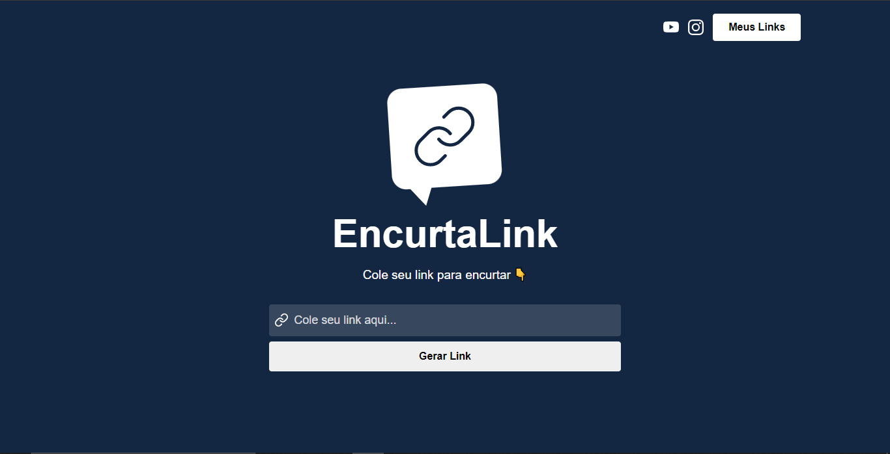
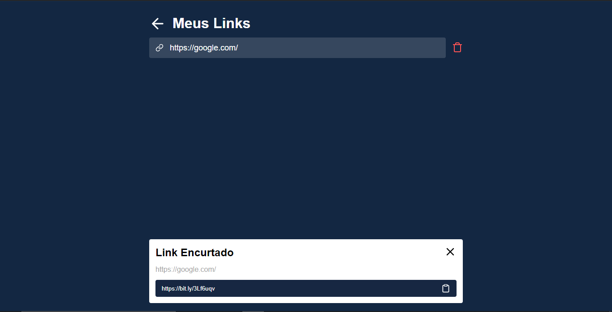

# 👨🏼‍💻encurta-links
É um encurtador de links, projeto criado na semana ReactJS do sujeito programador.
- feito em ReactJS
- Usando a API do bitly pra encurtar os links, os links encurtados ficam salvos no LocalStorage
## 👀 Previews

##  🔼 Link para acessar
https://encurta-links.vercel.app/
